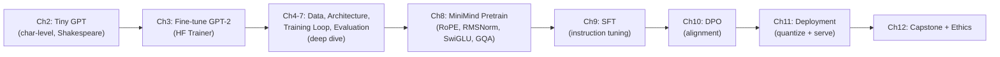

# GPT-from-Scratch → Fine-Tuning Runbook
**Source material:** *How to Build and Fine-Tune a Small Language Model* (Paul Liu)
**Purpose:** Project-based learning log for interview prep. Every entry documents *what* we did, *why* we did it, *how the code works*, and *how it's done at enterprise scale*.
**Format per session:** Goal → Concepts → Code Walkthrough → Enterprise Notes → Interview Angles → Checkpoint/Results → Open Questions

---

## 0. How We'll Work
- One chapter (or logical part of a chapter) per session.
- You write/run code yourself where possible (Colab or local); I explain the "why" before the "how," then we dissect the code line-by-line.
- Every chapter closes with: a short recap you could give in an interview, 3-5 likely interview questions with model answers, and a "what would change in production" note.
- This file grows as we go — I'll append a dated log entry after each session under **Part B: Session Log**.

---

## Diagram Policy
Every chapter that involves architecture, data flow, or a pipeline gets a diagram, not just prose:
- **In this file**: Mermaid diagrams (fenced ` ```mermaid ` blocks) — these render natively on GitHub and in most Markdown viewers, so the runbook stays diagram-rich even outside the chat.
- **In our chat sessions**: interactive SVG/HTML diagrams rendered inline when we're actively building/explaining something (e.g. stepping through attention shape transformations).
- Diagrams are added for: model architecture stacks, attention/data flow, training pipelines, the 3-stage MiniMind pipeline, deployment architecture, and repo/infra layout.

### Example — Part I/II/III/IV pipeline at a glance


---

## Infrastructure & Tooling

### VM recommendation: yes, spin up the Azure T4
A single T4 (16GB VRAM) comfortably covers **every** model in this book — even MiniMind-350M (Ch8-10) trains fine on one T4, just slower than an A100. So there's no need to size up; the win from a VM over Colab is *persistence* (no session resets, no reconnect-and-lose-state) and *control* (real SSH box you can automate, exactly like an enterprise training environment).

**Recommended spec:**
| Setting | Recommendation | Why |
|---|---|---|
| VM series | `Standard_NC4as_T4_v3` (4 vCPU, 28GB RAM, 1x T4 16GB) | Smallest/cheapest T4 SKU; plenty for these model sizes |
| Pricing | **Spot/low-priority** instance | 60-90% cheaper; fine since we checkpoint regularly (Ch6 covers this) — eviction just means resume from checkpoint |
| OS image | Ubuntu 22.04 LTS (or Azure "Data Science VM - Ubuntu") | Data Science VM comes with NVIDIA driver + CUDA + conda preinstalled, saves setup time |
| Disk | 64-128GB SSD | Datasets in Ch4/Ch8 can run several GB |
| Auto-shutdown | Enable (e.g. 8pm daily) | Avoid paying for idle GPU overnight |
| Region | Whichever has T4 spot capacity closest to you | Availability varies; check `az vm list-skus` |

**Rough cost:** on-demand NC4as_T4_v3 is roughly $0.50-0.55/hr in most US regions; spot pricing typically brings that to ~$0.15-0.20/hr. A few hours a day for this project should stay well under $20-30/month.

This mirrors how small-model training actually happens at a company: single GPU box, checkpointed runs, spot pricing to control cost — good talking points for interviews too ("how did you manage training cost" → "used spot instances with checkpoint/resume").

### Suggested VM setup sequence (once you provision it)
1. `ssh` in, confirm GPU: `nvidia-smi`
2. Create an isolated env: `conda create -n slm python=3.11 -y && conda activate slm`
3. Install core stack: `pip install torch --index-url https://download.pytorch.org/whl/cu121` then `pip install transformers datasets tokenizers accelerate matplotlib jupyterlab`
4. `git clone` the repo (see below) into the VM, work inside it
5. **Recommended editor workflow: VS Code Remote-SSH with SSH agent forwarding** — not a separate SSH key on the VM. See "Editor Workflow" below.

### Editor Workflow: VS Code Remote-SSH (recommended over a bare terminal)
Since the VM is spot/ephemeral, avoid putting a private GitHub key on it. Instead, forward your laptop's existing key for the duration of the session:

1. Install the **Remote - SSH** VS Code extension.
2. In your WSL2 `~/.ssh/config`, add an entry for the VM with `ForwardAgent yes`:
   ```
   Host slm-vm
       HostName <VM_PUBLIC_IP>
       User azureuser
       ForwardAgent yes
   ```
3. Load your existing GitHub key into the WSL2 agent: `eval "$(ssh-agent -s)" && ssh-add ~/.ssh/id_ed25519`
4. VS Code → "Remote-SSH: Connect to Host" → `slm-vm`. Terminal, file explorer, and Jupyter extension all now operate directly on the VM, authenticating git operations with your forwarded local key — no key generated or stored on the VM.
5. On the VM, only commit *metadata* is needed (not credentials):
   ```bash
   git config --global user.name "Your Name"
   git config --global user.email "you@example.com"
   ```
6. `git clone git@github.com:<you>/slm-from-scratch.git` now works on the VM, authenticated via your laptop.

Why this matters for interviews too: this is the standard pattern for working on ephemeral/shared compute — credentials stay on the trusted endpoint (your laptop), compute happens on the disposable one (the spot VM).

### GitHub repo
Good instinct — this doubles as an interview portfolio piece. Suggested structure (scaffolded locally, ready to push):

```
slm-from-scratch/
├── README.md                  # project overview, links back to runbook
├── RUNBOOK.md                 # this file, kept in sync
├── environment.yml            # conda env spec
├── requirements.txt           # pip fallback
├── .gitignore                 # data/, checkpoints/, *.pt, wandb/, etc.
├── setup_azure_vm.sh          # provisioning + env bootstrap script
├── ch02_gpt_from_scratch/
├── ch03_finetune_gpt2/
├── ch04_dataset_preparation/
├── ch05_architecture_config/
├── ch06_training_loop/
├── ch07_evaluation/
├── ch08_minimind_pretrain/
├── ch09_minimind_sft/
├── ch10_minimind_dpo/
├── ch11_deployment/
├── ch12_capstone/
└── diagrams/                  # exported architecture diagrams (svg/png)
```

Each chapter folder gets its own `README.md` (goal, how to run, results) plus notebooks/scripts and a `checkpoints/` (gitignored) subfolder.

I don't have your GitHub credentials, so I can't push directly — I've scaffolded everything locally and give you the exact `git init` / `git remote` / `git push` commands below.

---

## Part A: The Full Learning Plan

### Guiding path
The book itself recommends **Path A (Deep Understanding)**: Ch2 → Ch3 → Ch4-7 → Ch8-10 → Ch11-12. We'll follow that, since it matches your goal of *understanding*, not just running code — and it mirrors how an ML engineer actually ramps up on a new codebase (architecture first, then data, then scale, then productionization).

### Part I — Foundations
**Chapter 2: Build GPT from Scratch** (the core session — everything else is variations on this)
- What we build: a character-level GPT trained on tiny-Shakespeare, from raw tensors up.
- Concepts: tokenization (char-level), train/val split, context window / block size, batching, embeddings (token + position), self-attention (Q/K/V, scaled dot-product, causal masking), multi-head attention, feed-forward block, LayerNorm, residual connections, the full decoder-only stack, training loop, loss curves, sampling/generation, temperature.
- Enterprise angle: this is architecturally *identical* to GPT-2/GPT-3/LLaMA — only scale differs (layers, dims, tokenizer, data volume). Interviewers love asking you to derive attention from scratch or explain why causal masking matters.
- Deliverable: a working tiny GPT that generates Shakespeare-ish text + annotated code.

**Chapter 3: Quick Start – Fine-Tune GPT-2**
- What we build: fine-tune real pretrained GPT-2 on a small custom dataset (e.g. recipes) using Hugging Face.
- Concepts: difference between pretraining and fine-tuning, why fine-tuning is cheap (reusing learned representations), Hugging Face `Trainer`/`transformers` workflow, tokenizer reuse, saving/loading models, qualitative eval (before/after generations).
- Enterprise angle: this is the realistic "day 1 task" at most companies — you almost never pretrain from scratch; you fine-tune. Sets up contrast with full pretraining in Ch8.

### Part II — Training from Scratch, Deep Dive
**Chapter 4: Dataset Preparation**
- Sourcing real corpora (C4, ArXiv, PubMed, legal, code, proprietary data), cleaning/filtering, quality checks, tokenizer choice (char vs word vs BPE), training a custom BPE tokenizer with `tokenizers`.
- Enterprise angle: **data prep is 60-80% of real project time** — this is a very common interview talking point. Also: licensing/privacy considerations (HIPAA-style examples).

**Chapter 5: Model Architecture & Configuration**
- Parameter counting, the 4 key config decisions (depth, width, heads, context length), pre-configured architectures, scaling trade-offs, decision framework for sizing a model to your compute budget.
- Enterprise angle: cost-vs-quality tradeoffs, how teams pick a model size given a GPU budget and latency SLA.

**Chapter 6: Training Loop & Monitoring**
- Moving from toy loop to production loop: gradient accumulation, mixed precision, learning-rate schedules (warmup + cosine decay), gradient clipping, checkpointing/resuming, logging (W&B-style), troubleshooting OOM and non-converging runs.
- Enterprise angle: this chapter *is* MLOps — checkpointing/monitoring is exactly what's tested in "how would you debug a training run that diverges" interview questions.

**Chapter 7: Evaluation & Benchmarks**
- Perplexity, token accuracy, held-out validation, qualitative generation checks, standard benchmark awareness.
- Enterprise angle: how teams decide "is this model good enough to ship."

### Part III — The MiniMind Case Study (full 3-stage pipeline)
**Chapter 8: Stage 1 — Pretraining MiniMind**
- Modern architecture upgrades over our Chapter 2 toy model: RoPE (rotary position embeddings) instead of learned position embeddings, RMSNorm instead of LayerNorm, SwiGLU instead of ReLU/GELU, Grouped Query Attention (GQA). Full pipeline: data → custom tokenizer → dataset/tokenization → training from scratch → evaluation.
- Enterprise angle: RoPE/RMSNorm/SwiGLU/GQA are exactly the components in LLaMA, Mistral, Qwen — this chapter is your "modern architecture" interview prep in one place.

**Chapter 9: Stage 2 — Supervised Fine-Tuning (SFT)**
- Turning a raw language model into an instruction-follower: SFT data format, prompt/response masking, training config, full SFT script, testing.
- Enterprise angle: this is literally "how ChatGPT-style behavior is created" — a very common interview topic (pretraining vs SFT vs RLHF/DPO).

**Chapter 10: Stage 3 — Direct Preference Optimization (DPO)**
- Alignment without a separate reward model: preference pairs, DPO loss, why it replaced classic RLHF/PPO in many pipelines.
- Enterprise angle: DPO vs RLHF is a hot interview question right now — you'll be able to explain both from first-hand implementation.

### Part IV — Production
**Chapter 11: Production Deployment**
- Quantization (FP32 → INT8/Q4_K_M), serving with llama.cpp / vLLM / Ollama / Modal, batching for throughput, cost-vs-scale decision table.
- Enterprise angle: "how would you deploy this to serve 50K requests/day" is a standard systems-design-for-ML interview question — you'll have real numbers to cite.

**Chapter 12: Complete Production Projects & Ethics**
- End-to-end projects combining everything, plus responsible-AI considerations (bias, privacy, misuse).
- Enterprise angle: ethics/responsible-AI questions increasingly show up in ML interviews — good to have concrete examples ready.

---

## Suggested Cadence
| Session | Chapter(s) | Focus |
|---|---|---|
| 1 | Ch 2 | Build GPT from scratch (the big one — likely 2-3 sittings) |
| 2 | Ch 3 | Fine-tune GPT-2, contrast with pretraining |
| 3 | Ch 4 | Data pipelines at scale |
| 4 | Ch 5 | Architecture sizing/config |
| 5 | Ch 6 | Production training loop |
| 6 | Ch 7 | Evaluation |
| 7-9 | Ch 8-10 | MiniMind: pretrain → SFT → DPO |
| 10 | Ch 11 | Deployment |
| 11 | Ch 12 | Capstone + ethics |

We can go faster/slower — this is just a default pace.

---

## Part B: Session Log

### Milestone: VM Provisioning & GPU Driver Setup — 2026-07-17
**What we did:**
- Provisioned Azure `Standard_NC4as_T4_v3` spot VM (`vm-eus2-gpu-02`), plain Ubuntu 24.04 image (not the pre-loaded Data Science VM — driver wasn't preinstalled).
- `nvidia-smi` initially not found → installed `nvidia-driver-550-server` (server/datacenter branch, appropriate for a T4 in a headless cloud VM vs. the desktop driver variant) via `sudo ubuntu-drivers autoinstall` / explicit `apt install`, then rebooted.

**Verified:**
```
Driver Version: 595.71.05   CUDA Version: 13.2
GPU: Tesla T4, 16384MiB VRAM, 0% util, no running processes
```

**Why this matters:** `nvidia-smi`'s "CUDA Version" is the *max* CUDA runtime the driver supports — not something separately installed. PyTorch ships its own CUDA runtime in the pip wheel, so we don't install the CUDA toolkit system-wide; we only need the driver working, which it now is. Server-branch drivers matter for cloud GPU boxes because they're validated for headless/compute workloads rather than desktop rendering.

**Status:** ✅ GPU visible and healthy. Next: install Miniconda, create the `slm` env, verify `torch.cuda.is_available()`.

---

### Milestone: Miniconda install gotcha — 2026-07-17
Hit a `404` using `https://repo.anaconda.com/miniconda3/Miniconda3-latest-Linux-x86_64.sh`.
**Fix:** the correct path is `/miniconda/` (singular, no trailing "3") — the "3" only belongs in the filename:
```bash
mkdir -p ~/miniconda3
wget https://repo.anaconda.com/miniconda/Miniconda3-latest-Linux-x86_64.sh -O ~/miniconda3/miniconda.sh
bash ~/miniconda3/miniconda.sh -b -u -p ~/miniconda3
rm ~/miniconda3/miniconda.sh
~/miniconda3/bin/conda init bash
source ~/.bashrc
```
Worth remembering as an interview-adjacent lesson too: cloud setup scripts drift as vendors restructure their download infra — always sanity-check a fresh VM bootstrap against current docs rather than copy-pasting from memory/an old script.

---

### Milestone: Caught a private key before it entered git history — 2026-07-17
**What happened:** While syncing the local repo (`/mnt/c/Users/vammun01/slm-from-scratch` on Windows/WSL2) with GitHub, `git status` showed `vm-eus2-gpu-02_key.pem` (the VM's private SSH key) sitting **untracked** in the repo working directory.

**Why this mattered:** Private keys must never enter git history — being untracked (never `git add`ed) is the only state where cleanup is trivial. Once a secret is committed, deleting it in a later commit does *not* remove it from history; anything ever pushed to a remote must be treated as compromised and rotated.

**What we did:**
1. Verified nothing was committed yet: `git log --all --full-history -- "*.pem"` → empty output, confirming clean history.
2. Added `*.pem` to `.gitignore` to prevent any future accidental add.
3. Moved the key out of the repo folder entirely, into `~/.ssh/` — the general rule: credentials live in `~/.ssh` (or a secrets manager), never inside a project directory that gets version-controlled.
4. Updated the local SSH config's `IdentityFile` path to match the new location.

**Interview-relevant takeaway:** this is the standard "secrets hygiene" check in any code review / CI pipeline — tools like `git-secrets`, `truffleHog`, or GitHub's own push-protection scan for exactly this pattern. Good habit going forward: `git status` before every first commit in a new repo, and add `*.pem`, `*.key`, `.env` to `.gitignore` on day one rather than after the fact.

**Status:** ✅ Repo clean, key relocated, `.gitignore` updated and pushed.

---

### Milestone: Environment fully verified — setup phase complete — 2026-07-17
```
torch 2.13.0+cu130   torch.cuda.is_available() = True   device = Tesla T4
```
**Summary of the full setup chain:** Azure NC4as_T4_v3 spot VM provisioned → NVIDIA server driver installed (595.71.05) → Miniconda installed (with a URL correction: `/miniconda/` not `/miniconda3/`) → `slm` conda env created from `environment.yml` → GitHub repo pushed from laptop and cloned onto the VM via SSH agent forwarding (no keys duplicated) → accidentally-untracked private key caught and relocated before any commit → PyTorch confirms GPU visibility.

**Status:** ✅ Infrastructure ready. All subsequent chapter work happens in the `slm` conda env on this VM, edited via VS Code Remote-SSH, version-controlled through the `slm-from-scratch` GitHub repo.

**Next:** Chapter 2 — Build GPT from Scratch.

---

## Chapter 2: Build GPT from Scratch

### Stage 1: Data loading + character-level tokenization — 2026-07-17
**Goal:** turn raw Shakespeare text into batched integer tensors ready for embeddings.

**What we built** (`ch02_gpt_from_scratch/gpt_from_scratch.ipynb`):
- Downloaded tiny-Shakespeare (~1.1M characters)
- Built the vocabulary: 65 unique characters = our entire "tokenizer" alphabet
- `stoi`/`itos` dictionaries + `encode`/`decode` lambdas — the whole tokenizer is just two lookup tables
- Encoded the full dataset into one `torch.long` tensor
- 90/10 train/val split
- Demonstrated `block_size` (context window): one window of length 8 yields 8 separate (context → target) training pairs
- `get_batch()`: stacks multiple random windows into a `(batch_size, block_size)` tensor for parallel GPU processing

**Why (see diagram + explanation above the code):** char-level tokenization is the simplest possible text→number mapping, so the mechanics stay visible; every production tokenizer (BPE, SentencePiece) is a fancier version of the same `stoi`/`itos` idea with a learned, larger vocabulary (Chapter 4). Train/val split is how we'll later detect overfitting. `block_size` is the parameter that directly trades inference "memory" against compute cost (attention is O(n²) in sequence length).

**Enterprise note:** production tokenizers are trained once on a large corpus and reused across the whole training pipeline (and at inference) — never rebuilt per-run the way our toy `stoi`/`itos` is. Chapter 4 covers training a real BPE tokenizer with the `tokenizers` library.

**Interview angles:**
- "Why not just use words as tokens?" → vocabulary explosion, can't handle unseen words, no subword sharing across morphological variants ("run"/"running").
- "What does `block_size` control, and what's the tradeoff of increasing it?" → context length vs. O(n²) attention compute/memory.
- "Why split train/val before training even starts?" → validation loss is the only unbiased overfitting signal; can't be computed on data the model has seen.

**Status:** ✅ Stage 1 complete. Next: Stage 2 — token + position embeddings, first self-attention head.

---
*(Further milestones/sessions appended below as we complete them.)*
