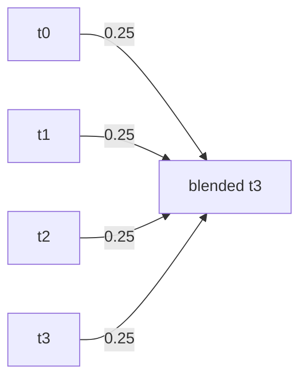

# Chapter 2 Walkthrough — Build GPT From Scratch

Companion to `gpt_from_scratch.ipynb`. This doc is for *understanding*, not reference — read it
alongside the code, not instead of it. `RUNBOOK.md` (repo root) has the milestone log, why-we-did-it
notes, and interview angles; this file has the line-by-line mechanics.

**One example runs through this entire document**, so numbers stay consistent and comparable
end-to-end: the sentence `"the cat sat on the mat. the cat ran to the mat. the dog sat too."`
(64 characters, 14-character vocabulary: `[' ', '.', 'a', 'c', 'd', 'e', 'g', 'h', 'm', 'n', 'o', 'r', 's', 't']`).
All numbers below were actually executed, not hand-computed — you can reproduce every one of them.

---

## Stage 2: The Bigram Language Model

### Why build this first?
It's deliberately the dumbest possible language model — one character predicts the next, with zero
memory of anything earlier. We build and train it *before* self-attention specifically so the failure
mode is visible and motivated, not just asserted. You'll feel exactly why attention is necessary.

### The model's only layer
```python
self.token_embedding_table = nn.Embedding(vocab_size, vocab_size)
```
- **What it is:** a lookup table, one row per character in the vocabulary.
- **The content of each row:** raw scores (logits) for "what character comes next," one score per
  possible next character.
- **Size:** with our 14-character vocab, this is a 14x14 grid -- 14 rows (one per input character), 14
  columns (one score per possible next character). In the real Shakespeare notebook, 65x65.

This is *not* a normal embedding used for meaning -- because `nn.Embedding(vocab_size, vocab_size)`
maps each token directly to a full row of next-token scores, the "embedding" and the "prediction" are
the same table. That's what makes this a bigram model rather than a real language model: no
intermediate representation, no way to combine information from more than one character.

> **Common point of confusion, worth stating explicitly:** the embedding table's starting values are
> **not targets**. They're the model's randomly-initialized *weights/parameters* -- before training,
> PyTorch fills every row with small, arbitrary random numbers via a specific initialization scheme.
> **Targets** are the actual next-characters from the real text; they never change, and they're what
> predictions get compared against. Training is the process of nudging the random starting weights,
> step by step, so that looking up a row starts pointing toward the *real* target for that character.

---

## The whole pipeline, once, at a glance

Before the line-by-line dive, here's the full path from text to a trained (if still weak) model, with
real executed output at every stage, so you have the big picture before zooming in.

### Step 1 -- the sequence
64 characters, encoded via `stoi`; round-trip through `decode(encode(text))` confirms the mapping is
lossless.

### Steps 2-3 -- train/val split
90/10 -> 57 training characters, 7 validation characters. (This toy example is tiny for
illustration -- the real notebook splits ~1M/~110K characters the same way.)

### Step 4 -- forming a batch
```
xb (inputs)  shape: (4, 8)   -> B=4 sequences, T=8 characters each
yb (targets) shape: (4, 8)   -> same shape, shifted 1 character later

First sequence: input ' the cat' -> target 'the cat '
```
`yb` is **not** a longer continuation of `xb` -- it's the exact same length, just each character shifted
one position later in the source text. `yb[t]` is always "whatever character comes right after `xb[t]`
in the real text," position by position.

### Step 5 -- logits shape and the flatten
Real (not cherry-picked) randomly-initialized embedding rows before any training:
```
Row 0 (' '): [1.927, 1.487, 0.901, -2.106, 0.678, ...]
Row 1 ('.'): [-0.769, 0.762, 1.642, -0.160, -0.497, ...]
```
Small arbitrary floats -- exactly what "random init" looks like; nothing meaningful yet.
```
Raw logits shape: (4, 8, 14)  -> (B, T, C)
After view():     logits (32, 14), targets (32,)      [4*8 = 32 independent examples]
```

### Step 6 -- cross entropy
```
Loss (untrained model):        3.3848
Theoretical random-guessing:   2.6391   (= -log(1/14))
```
Same ballpark (small-batch sampling noise keeps them from matching exactly with only 32 examples) --
confirms the model starts knowing nothing, as expected.

### Step 7 -- real training, loss over iterations
```
Step    0: loss = 3.0829
Step  200: loss = 1.3798
Step  400: loss = 0.8465
Step  600: loss = 0.7110
Step  800: loss = 0.7360
Step 1600: loss = 0.8172
Step 2000: loss = 0.7943
```
Drops fast, then bounces around rather than smoothly decreasing forever -- normal here, for two
reasons: (1) every step samples a fresh random batch, so per-step "difficulty" varies, and (2) this
corpus is so small (57 characters) the model nearly memorizes it, so it's oscillating near its actual
floor. On the real Shakespeare corpus (1.1M characters) the curve is much smoother because per-batch
noise averages out over far more data.

### Step 8 -- generation after training
```
' cat t. t don mato ratog t sat. do mat. t rat to t o san mato'
```
Recognizable fragments (`cat`, `mato`, `sat.`) because strong character-pair statistics were learned
from this small repetitive corpus -- but still no real coherence. Why, exactly, is the subject of the
rest of this document.

---

## `forward()`, line by line

### When/how it actually gets called
You never call `model.forward(xb, yb)` directly. Writing `model(xb, yb)` triggers Python's `__call__`
protocol; `nn.Module` implements `__call__` internally and that in turn invokes your `forward()` method
(plus autograd bookkeeping). Concretely: `model(xb, yb)` -> `nn.Module.__call__` -> `forward(xb, yb)`.
This happens in three places in the notebook: the sanity-check cell (one pass), every step of the
10,000-step training loop, and inside `generate()` (with `targets=None`, so the loss branch is skipped).

### The lookup -- `logits = self.token_embedding_table(idx)`
Zooming into one specific example for exact tracing: take the 7-character slice `xb = "the cat"`
(indices 0-6 of the source text) with target `yb = "he cat "` (indices 1-7 -- same length, shifted by
one, per the Step 4 clarification above).
```
Full text:  t  h  e     c  a  t     s  a  t
index:      0  1  2  3  4  5  6  7  8  9  10

xb = "the cat"     (indices 0-6, 7 characters)
yb = "he cat "     (indices 1-7, SAME 7 characters, each one position later)
```
This line does **not** treat `"the cat"` as one unit. It looks up each of the 7 characters
*individually*, and returns each one's own row from the embedding table:
```
position t=0  char='t' -> logits row: [0.479, 1.354, -0.159, ...]   (14 scores, one per possible next char)
position t=1  char='h' -> logits row: [0.785, 0.029, 0.641, ...]
position t=2  char='e' -> logits row: [-1.055, 1.278, -0.172, ...]
... (7 rows total, one per input character)
```
`logits` shape is `(B=1, T=7, C=14)` -- literally "for each of the 7 positions, here are the 14 scores
for what character comes next."

### `B, T, C` -- the glossary
These three letters show up constantly in transformer code -- worth memorizing cold:
- **B (Batch):** how many independent sequences are processed simultaneously.
- **T (Time):** how many tokens are in each sequence (this is `block_size` at training time).
- **C (Channels):** the width of the score/feature vector at each position -- here, `vocab_size`,
  because the bigram model's "features" are literally next-token scores. In later stages `C` becomes
  `n_embd` (the embedding dimension) once we introduce real embeddings.

### Why `B*T` when flattening?
```python
B, T, C = logits.shape
logits = logits.view(B*T, C)
targets = targets.view(B*T)
loss = F.cross_entropy(logits, targets)
```
For our traced example: `B=1, T=7 -> B*T = 7`. There are 7 *individual characters* in this batch, and
each one needs its own "was the prediction correct?" score. `cross_entropy` doesn't understand
"batch" vs. "time" as separate concepts -- it just wants a flat list of `(prediction, correct_answer)`
pairs. Flattening turns `(1, 7, 14)` into `(7, 14)` -- 7 independent classification examples, each with
14 candidate scores. (In the batched Step 4-6 example above, the same flatten turns `(4, 8, 14)` into
`(32, 14)` -- 32 independent examples, one per character position across all 4 sequences.)

### The actual cross-entropy math, per position
For each position: turn the 14 raw scores into probabilities with softmax, then take `-log()` of the
probability assigned to the *actual correct answer*:
```
pos 0: 't' -> predicting 'h'   P(correct)=0.1330  -> loss = 2.0178
pos 1: 'h' -> predicting 'e'   P(correct)=0.0281  -> loss = 3.5732
pos 2: 'e' -> predicting ' '   P(correct)=0.0240  -> loss = 3.7277
pos 3: ' ' -> predicting 'c'   P(correct)=0.0049  -> loss = 5.3222
pos 4: 'c' -> predicting 'a'   P(correct)=0.0147  -> loss = 4.2197
pos 5: 'a' -> predicting 't'   P(correct)=0.1441  -> loss = 1.9372
pos 6: 't' -> predicting ' '   P(correct)=0.0737  -> loss = 2.6077

Manual average of these 7:        3.3436
F.cross_entropy(logits, targets): 3.3436   <- exact match
```
That match is the key confirmation: **`F.cross_entropy` is literally this loop**, done in one
vectorized call, averaging the 7 per-position losses into the single number `.backward()` uses. Every
one of these 7 losses is high right now (untrained, random weights) -- training's whole job is to push
each one down.

### The mechanism, restated precisely
Cross-entropy does **not** compare row `'t'` against row `'h'`. When the input character is `'t'`, the
model pulls out row `'t'` -- 14 scores, one slot per possible next character, including a slot for
`'h'`. Softmax normalizes *within that row*; cross-entropy asks "how much probability mass, relative
to the other 13 scores in this same row, landed on the `'h'` slot?" Training's job is to raise that one
slot's value *relative to its row-mates* -- which, because softmax is zero-sum within a row, also means
pushing the other 13 scores in that row down. Row `'t'` and row `'h'` remain otherwise unrelated,
independently-updated rows; nothing here creates a relationship between different rows.

### Sanity-check print
```python
print(f"Expected loss: {-torch.log(torch.tensor(1.0/vocab_size)):.4f}")
```
An untrained model's weights are random, so it's guessing uniformly at random over the vocabulary. This
line computes the cross-entropy loss that *pure random guessing* would produce (`2.6391` for our
14-character vocab, `~4.17` for the real 65-character Shakespeare vocab). If the model's actual initial
loss matches this number, that confirms correct initialization -- nothing broken, biased, or leaking
information it shouldn't have yet.

---

## `generate()`, line by line

```python
logits = logits[:, -1, :]
```
In the notebook, generation always starts from a single seed context (`context = torch.zeros((1, 1))`,
i.e. `B=1`) and grows one character at a time. At each step, the full sequence so far is re-run through
the model, producing `logits` of shape `(1, T, 14)` where `T` grows every iteration. The bigram model
only ever cares about the single most recent character, so this slice discards every earlier
prediction and keeps only the last time step: `(1, T, 14) -> (1, 14)`.

```python
probs = F.softmax(logits, dim=-1)
idx_next = torch.multinomial(probs, num_samples=1)
```
`softmax` turns the 14 raw scores into probabilities summing to 1. `torch.multinomial` then samples one
character from that distribution -- a **weighted random draw**, not "always pick the highest score"
(that would be greedy decoding, which we're not using here -- it's why generated text differs run to
run even from the same trained model).

```python
idx = torch.cat((idx, idx_next), dim=1)
```
Appends the newly sampled character onto the sequence, so the next loop iteration's forward pass sees
one more character of context (even though the bigram model still only *uses* the last one).

---

## Training, traced step by step on the real example

### Real traced example: training on `xb="the cat"`, `yb="he cat "` for 6 steps
Continuing the same 7-character slice from above, watch the score in the `'h'` slot of row `'t'` (the
one predicting what follows `'t'`) evolve as we train on this one example repeatedly:
```
Step | loss   | score['t'->'h'] | P(next='h'|'t')
   0 | 3.3436 | +1.1676          | 0.1552
   1 | 3.1621 | +1.2662          | 0.1799
   2 | 2.9842 | +1.3643          | 0.2066
   3 | 2.8104 | +1.4617          | 0.2351
   4 | 2.6412 | +1.5579          | 0.2647
   5 | 2.4771 | +1.6527          | 0.2950
```
Loss falls, the `'h'` slot's score rises, `P(correct)` climbs from 13% -> 30% in 6 steps.

**The whole row moves, not just the target slot** (softmax cross-entropy pushes the correct slot up and
every other slot in the same row down, since they all compete for the same probability mass):
```
slot ' ': +0.479 -> +1.071      slot 'm': +1.307 -> +0.705
slot '.': +1.354 -> +0.752      slot 'n': +0.460 -> -0.136
slot 'a': -0.159 -> -0.752      slot 'o': +0.262 -> -0.333
slot 'c': -0.425 -> -1.016      slot 'r': -0.760 -> -1.349
slot 'd': +0.944 -> +0.345      slot 's': -2.046 -> -2.628
slot 'e': -0.185 -> -0.777      slot 't': -1.529 -> -2.114
slot 'g': +0.185 -> -0.409
slot 'h': +1.069 -> +1.653   <-- target slot, the only one that rises
```

**Rows for characters never seen in this batch are nearly, but not perfectly, frozen** -- e.g. row `'g'`
(never appears in `"the cat"`) shifts by a tiny amount even though its gradient was exactly zero:
```
before: [0.536, 0.525, 1.141, ...]
after:  [0.533, 0.521, 1.134, ...]   (tiny shrink toward zero)
```
This is **AdamW's weight decay** (see below) acting on every parameter every step regardless of
whether it received a real gradient this batch -- a small stabilizing pull toward zero, distinct from
the loss-driven signal that moves rows with actual gradient.

### The training loop, code line by line
```python
xb, yb = get_batch('train')
```
Grab `batch_size` (32, in the real training loop) random snippets. `xb` = current characters, `yb` =
the actual next characters that followed them in the real text -- the ground truth.

```python
logits, loss = model(xb, yb)
```
Forward pass: the model predicts, then compares its predictions to `yb` and computes a penalty score.
Early on (step 0) this loss is close to the random-guessing baseline -- the model knows nothing yet.

```python
optimizer.zero_grad(set_to_none=True)
```
PyTorch accumulates gradients by default (adds new ones to old ones) -- this wipes the slate before
computing new gradients, so last step's calculation doesn't contaminate this one.

```python
loss.backward()
```
Computes the gradient: for every number in the embedding table, how much would nudging it up or down
change the loss? This is "feeling the slope."

```python
optimizer.step()
```
AdamW uses that slope (plus its memory of recent steps) to actually update the embedding table's
numbers, moving them toward better predictions.

### The mental model -- a blind hiker on a foggy mountain
Looking for the lowest point (the point of best predictions):
- **The hiker** = the model's current weights (its position on the "loss landscape")
- **The slope underfoot** = the gradient, computed by `loss.backward()` -- which direction is downhill
- **The guide dog** = the AdamW optimizer -- remembers recent steps and nudges the hiker smoothly
  toward the bottom rather than lurching around

### Why AdamW specifically
"Adaptive Moment Estimation with Weight decay" -- the default optimizer for nearly all modern deep
learning, including GPT-4-class models, because it combines three things:
1. **Momentum** -- like a heavy ball rolling downhill, it carries through small bumps/local
   irregularities in the loss landscape instead of getting stuck.
2. **Adaptive per-parameter learning rates** -- frequent characters (like `e`) get smaller, more
   careful updates; rare characters (like `z`) get larger updates so they actually learn from the few
   examples they appear in.
3. **Weight decay (the "W")** -- a gentle penalty that keeps weights small and smooth, shrinking every
   parameter slightly toward zero every step regardless of gradient (demonstrated above with row
   `'g'`) -- this is what prevents the model from over-fitting to any single pattern it's seen.

### What actually happens over 10,000 real training steps
Loss drops from ~4.7 (random, on the full 65-character Shakespeare vocab) to ~2.4-2.5. The model is
tuning its lookup table so that common character pairs (like `t` -> `h`) get higher scores. That's *all*
it can learn -- pairwise statistics, nothing longer-range.

---

## Why the output is still gibberish

Generated text (from the real Shakespeare-trained model): `CEng ay, Theyomy t blll,...` -- slightly more
English-shaped than pure noise, but still broken. **The bigram model has zero memory beyond one
character.**

Concrete example: to spell "t-h-e," after printing `t`, the model wipes its memory and looks only at
`h` to decide the next letter. But `h` alone is ambiguous -- "that" wants `a` next, "this" wants `i`,
"the" wants `e`. Since the model can't see that a `t` came before the `h`, it's guessing blind at every
single step, and the result is a chaotic mix of fragments from different words.

**This is exactly the problem self-attention solves** -- letting every character look back at
everything before it, not just the immediately preceding one. That's Part 9 onward.

---

## Stage 3: The mathematical trick behind self-attention (Part 9)

### The problem, restated
Recall the bigram model's failure: predicting the character after `h`, it had **zero information about
what came before `h`**. Whether the source text was "t-h-e", "t-h-i-s", or "t-h-a-t", the model saw
only `h` and had to guess blind — because each token's prediction depended *only on that token's own
embedding row*, nothing else.

**What we want:** every token's representation to somehow "know about" the tokens that came before it
-- so the vector representing `h` at that position isn't just "generic h," but something like "h, in
the context of everything that led up to it." That's what people mean by tokens "communicating" or
"attending to" each other.

**The question Part 9 answers:** what's the simplest possible mechanism to make a token's
representation depend on earlier tokens, in a way that's fast (parallelizable on a GPU, not a slow
loop)? The deliberately crude answer at this stage: **averaging.**

### A concrete walkthrough of the intent
**Note:** this uses the exact same tensor the notebook actually creates (`torch.manual_seed(42)`,
`B=4, T=8, C=2`) -- specifically the first sequence's first 4 tokens (`x[0, :4]`), so these numbers
are reproducible by running the real cell, not a separate illustration.
```
Original vectors (each token described ONLY by itself):
t0: [ 1.927,  1.487]
t1: [ 0.901, -2.106]
t2: [ 0.678, -1.235]
t3: [-0.043, -1.605]
```
After the averaging trick:
```
Blended vectors (each token now describes itself + everything before it):
t0: [ 1.927,  1.487]   <- unchanged (nothing before it to blend in)
t1: [ 1.414, -0.309]   <- average of t0, t1
t2: [ 1.169, -0.618]   <- average of t0, t1, t2
t3: [ 0.866, -0.864]   <- average of t0, t1, t2, t3
```
Look at `t3` specifically: its original vector `[-0.043, -1.605]` described *only* token 3 in isolation.
Its new vector `[0.866, -0.864]` is a completely different number -- because it's no longer "just token
3," it's now a summary that has genuinely absorbed information from tokens 0, 1, and 2 as well. That,
mechanically, is what "communication between tokens" means here: a token's outgoing representation
stops being purely about itself and starts encoding something about its whole history.

**Picture it as a fan-in diagram:** draw the 4 tokens in a row; token `t3`'s blended output has an
equal-thickness line arriving from every earlier token (t0, t1, t2) plus itself -- 4 lines, all the
same weight (0.25 each). Compare that to the bigram model, which had **zero** such lines -- only the
box itself mattered.


### The important caveat -- why plain averaging isn't the real answer yet
Uniform averaging alone is a weak, naive mechanism, and Part 9 knows that -- it's a deliberate
stepping stone, not the destination. Three real problems with it:
1. **Every past token gets equal weight**, regardless of relevance. Predicting after `q`, the letter
   `u` (however far back) should matter enormously -- plain averaging can't give it special emphasis
   over some irrelevant character in between.
2. **Dilution as context grows.** By token 1000, the average of 1000 tokens has diluted any individual
   token's influence to almost nothing -- no ability to sharply focus on one specific important thing.
3. **Nothing is learned.** The weights are fixed at `1/(t+1)` for everyone, always -- no way for the
   model to adapt what it attends to based on actual content.

**This is exactly what Part 10 fixes.** Instead of a fixed uniform-weight matrix, self-attention
computes the weights from learned Query and Key projections of the data itself -- so instead of
"average everything equally," the model learns something closer to "strongly weight *that* earlier
token, barely weight this other one." The matrix-multiply *mechanism* built below stays identical --
only where the weights come from changes.

**One-line summary: Part 9 builds the plumbing -- a fast, parallelizable way to blend information
across positions via a weight matrix. Part 10 makes those weights learnable instead of fixed, which is
what actually solves the bigram model's problem.**


### Version 1 -- naive loop, tied to the fan-in picture
Goal: replace every token with the average of itself and every token before it (never tokens after --
that would leak future information the model shouldn't have at that position).
```python
xbow = torch.zeros((B, T, C))
for b in range(B):
    for t in range(T):
        xprev = x[b, :t+1]              # all tokens from position 0 through t
        xbow[b, t] = torch.mean(xprev, dim=0)
```
Walking it through our 4-token example, position by position -- each step asks "how many fan-in lines
are active *at this position*?":
```
t=0: only itself active (0 incoming lines)          -> xbow[0] = [ 1.927,  1.487]
t=1: 1 incoming line (from t0)                       -> xbow[1] = [ 1.414, -0.309]
t=2: 2 incoming lines (from t0, t1)                  -> xbow[2] = [ 1.169, -0.618]
t=3: 3 incoming lines (from t0, t1, t2)               -> xbow[3] = [ 0.866, -0.864]
```
This is the "growing fan" -- earlier positions have a smaller, partial fan simply because they don't
have as much history yet. That growth pattern (0 lines, then 1, then 2, then 3) is exactly what the
triangular shape in Version 2 encodes directly as a matrix. Correct, but two nested Python loops --
painfully slow at real scale (`T=1024`, `B=64` in production).

### Version 2 -- the matrix *is* the fan diagram, written as numbers
**Key insight: a lower-triangular matrix of 1s, row-normalized, IS an averaging operation when
multiplied against your data.**
```
torch.tril(torch.ones(4, 4))          row-normalized (each row = that token's fan-in weights):
[[1., 0., 0., 0.],                    [[1.00, 0.00, 0.00, 0.00],   <- t0: no fan-in, 100% self
 [1., 1., 0., 0.],          ->         [0.50, 0.50, 0.00, 0.00],   <- t1: 2 equal lines
 [1., 1., 1., 0.],                     [0.33, 0.33, 0.33, 0.00],   <- t2: 3 equal lines
 [1., 1., 1., 1.]]                     [0.25, 0.25, 0.25, 0.25]]   <- t3: 4 equal lines (the fan picture)
```
Row `t` has 1s in columns `0..t` ("I can see these") and 0s after ("future, invisible"). Row-normalizing
turns "can see" into "equal-weighted average over everything I can see" -- and row `t3`'s
`[0.25, 0.25, 0.25, 0.25]` is literally "4 equal-thickness fan-in lines," matching the picture directly.
```python
xbow2 = wei @ x   # (T, T) @ (B, T, C) -> (B, T, C), broadcast across the batch
```
**The actual arithmetic, worked by hand for two rows** (`wei @ x` computes, for every output position
`t` and every feature channel `c`: `output[t,c] = sum over s of wei[t,s] * x[s,c]` -- a dot product
between that row of weights and that column of the data):
```
Row t=2 weights: [0.333, 0.333, 0.333, 0.000]
  output[2,0] = 0.333*1.927 + 0.333*0.901 + 0.333*0.678  = 1.1687
  output[2,1] = 0.333*1.487 + 0.333*(-2.106) + 0.333*(-1.235) = -0.6176

Row t=3 weights: [0.250, 0.250, 0.250, 0.250]
  output[3,0] = 0.25*1.927 + 0.25*0.901 + 0.25*0.678 + 0.25*(-0.043) = 0.8657
  output[3,1] = 0.25*1.487 + 0.25*(-2.106) + 0.25*(-1.235) + 0.25*(-1.605) = -0.8644
```
These match `xbow[2]` and `xbow[3]` from the loop version exactly -- confirming the matmul is doing
nothing more mysterious than a weighted sum per row, computed for every row simultaneously. In the
real batched case, `x` has shape `(B, T, C)` while `wei` is only `(T, T)` -- PyTorch broadcasts the
2D weight matrix across the batch dimension, applying the *identical* weighting scheme to every
sequence in the batch in one call, rather than looping over `B` separately.

One matrix multiply, run in parallel on the GPU, replaces both nested loops entirely -- every row of
the matrix independently produces its own blended output *simultaneously*, instead of the loop visiting
positions one at a time. `torch.allclose(xbow, xbow2)` -> `True` -- verified identical output.

### Version 3 -- same fan diagram, built from "scores" instead of hard-coded weights
Version 2 hard-codes the weights as `1/(t+1)` directly. Version 3 instead starts from raw *scores*
(here, all zeros) and derives the identical weights through masking + softmax -- the structure real
self-attention will actually use.
```python
tril = torch.tril(torch.ones(T, T))
wei3 = torch.zeros((T, T))                          # raw "affinity scores" -- all zero for now
wei3 = wei3.masked_fill(tril == 0, float('-inf'))   # future positions -> -inf
wei3 = F.softmax(wei3, dim=-1)                      # -inf -> exactly 0 probability after softmax
xbow3 = wei3 @ x
```
```
Scores after masking:              After softmax (identical to Version 2's weights):
[[0., -inf, -inf, -inf],           [[1.0000, 0.0000, 0.0000, 0.0000],
 [0., 0., -inf, -inf],       ->      [0.5000, 0.5000, 0.0000, 0.0000],
 [0., 0., 0., -inf],                 [0.3333, 0.3333, 0.3333, 0.0000],
 [0., 0., 0., 0.]]                   [0.2500, 0.2500, 0.2500, 0.2500]]
```
`softmax(-inf) = 0` exactly -- masking gets baked directly into the probability distribution rather than
needing a separate normalization step. `torch.allclose(xbow, xbow3)` -> `True` -- again identical.

**The softmax math, worked exactly, row `t=2`:** softmax's formula is
`softmax(z)_i = exp(z_i) / sum_j exp(z_j)` -- exponentiate every score, then divide each by the total,
so the result is a proper probability distribution (all values positive, summing to 1).
```
Row t=2 raw scores (after masking):      [0,     0,     0,     -inf]
exp() of each:                           [1.0,   1.0,   1.0,   0.0 ]   <- exp(-inf) = 0 exactly
sum of exp:                               3.0
divide each by the sum:                  [0.333, 0.333, 0.333, 0.0 ]
```
This matches `wei[2]` from Version 2 exactly. Note *why* it comes out uniform here: every unmasked raw
score was the same value (0), so `exp()` of each is identical (1.0), so dividing by the sum necessarily
gives equal shares. Masking's only job in Part 9 is to zero out disallowed (future) positions -- it
isn't yet *differentiating* between allowed positions, because there's no signal telling it to.

**Preview: what happens once scores aren't all equal (this is what Part 10 actually does).** Suppose,
hypothetically, the raw scores for row `t=2` were `[2.0, 0.5, -1.0]` (real values a Query-Key dot
product might produce) instead of `[0, 0, 0]`:
```
Raw scores (position 3 masked, since t=2 can't see the future): [2.0,    0.5,    -1.0,   -inf]
exp() of each:                                                   [7.389,  1.649,  0.368,  0.0 ]
sum of exp:                                                       9.406
divide each by the sum:                                          [0.786,  0.175,  0.039,  0.0 ]
```
Now the weights are *unequal*: token 0 gets 78.6% of the blend, token 1 gets 17.5%, token 2 only 3.9% --
softmax turned "token 0 scored highest" into "token 0 dominates the weighted average," while still
guaranteeing everything sums to 1 and the future stays at exactly 0. This is exactly the mechanism Part
10 plugs real, learned Query·Key scores into -- nothing about the softmax step changes; only where the
numbers `[2.0, 0.5, -1.0]` come from changes, from "made up for illustration" to "computed from the
data by a trained linear layer."

**Why bother with this roundabout path if the answer's the same?** Because this is the exact
computational shape self-attention uses -- and in Part 10, those starting "scores" stop being zero.
They become the dot product of a learned Query vector (from the current token) and learned Key vectors
(from every earlier token) -- so instead of every fan-in line being forced equal by construction, the
model computes *how relevant* each earlier token actually is, and softmax turns those relevance scores
into unequal line-thicknesses. The fan diagram doesn't change shape -- only the thickness of each line
stops being hard-coded and starts being learned from data.

---

## Stage 4: Implementing self-attention with Query, Key, Value (Part 10)

**The one-sentence shift from Stage 3:** the "scores" that used to be hardcoded zeros are now computed
from the data itself, via three separate learned linear layers -- Query, Key, and Value. Everything
downstream (causal mask, softmax, weighted sum) is identical machinery to Version 3 above.

### The intuition: a speed-dating event
Self-attention lets tokens "talk" to each other and figure out who's relevant to whom, based on data
rather than a fixed rule. Think of a speed-dating event where every token wants to find its best match
among the tokens before it:
1. **Query** -- a token's dating profile: "this is what I'm looking for."
2. **Key** -- a token's profile: "this is who I am / what I offer."
3. **Attention score** -- the compatibility score between a Query and a Key (their dot product).
4. **Value** -- the actual, deep information shared once two tokens find a good match.

### Architecture pipeline (the pieces, and why each exists)
```
Input embeddings (x)
        |
        v
  ---------------------------
  |          |              |
Query      Key            Value        <- 3 separate learned projections, C -> head_size
"what am I  "what do I     "what I
looking for" contain"      actually share"
  |          |              |
  -----------+              |
        |                   |
        v                   |
Scores = Q . K (per pair)   |          <- how relevant is each past token, per query
        |                   |
        v                   |
Scale by 1/sqrt(head_size)  |          <- keeps softmax from saturating (see below)
        |                   |
        v                   |
Mask future with -inf       |          <- no peeking ahead during training
        |                   |
        v                   |
Softmax -> percentages      |          <- turns scores into weights that sum to 1
        |                   |
        +-------------------+
        v
Output = weights . V                   <- context-aware token representation
```

### Why shrink Q and K down to `head_size` (e.g. 16) instead of keeping the full embedding width (e.g. 32)?
Extending the dating analogy: imagine everyone's full profile has 32 traits -- hobbies, humor, values,
career, taste in music, everything. Comparing two people by matching all 32 traits at once is expensive
and noisy; most traits are irrelevant to "will these two get along." Instead, each token writes a
condensed `head_size`-trait summary specifically for matching -- the Query/Key projection is that
summary-writer, learned during training to keep only what's useful for compatibility scoring. Two
concrete reasons this matters:
1. **Cost.** The score matrix is always `T x T`, but computing/storing it involves vectors of length
   `head_size` -- smaller `head_size` means less compute per pair, which matters enormously once `T` is
   in the thousands.
2. **Setting up Part 11 (the real payoff).** One matchmaker comparing all 32 traits at once is worse
   than *several independent matchmakers*, each specializing in a smaller slice -- one who only cares
   about humor compatibility, another who only cares about shared values. That's multi-head attention:
   multiple heads, each with its own smaller `head_size`, each free to learn a *different kind* of
   relevance. Their outputs get concatenated back together (e.g. 4 heads x `head_size=8` = 32 again) --
   reducing dimensionality per head is what makes room for that specialization.

### The masking + softmax math, real numbers, using our own `"t","h","e"` example
An actual (untrained, randomly-initialized) attention head run on these three characters:
```
Raw scores, after scaling, before masking:
Row "t": [ 0.066, -0.285,  0.049]
Row "h": [-0.055,  0.318, -0.075]
Row "e": [ 0.141, -0.302, -0.083]

After masking the future with -inf:
Row "t": [ 0.066, -inf,  -inf ]    <- t can only see itself
Row "h": [-0.055, 0.318, -inf ]    <- h can see t and itself
Row "e": [ 0.141, -0.302, -0.083]  <- e can see t, h, and itself

After softmax (percentages):
Token "t": [100.0%,   0.0%,   0.0%]  --> attends 100% to "t"
Token "h": [ 40.8%,  59.2%,   0.0%]  --> attends 41% to "t", 59% to "h"
Token "e": [ 41.0%,  26.3%,  32.7%]  --> attends 41% to "t", 26% to "h", 33% to "e"
```
The output step for `"e"`:
```
Output("e") = 41.0% * Value("t") + 26.3% * Value("h") + 32.7% * Value("e")
```
**Honest note on these numbers:** the split here is fairly mild (41/26/33) because these weights are
completely untrained -- random initialization. A trained model would sharpen this considerably (e.g. a
confident 90%+ toward whichever earlier character actually predicts what comes next) once it's learned
real patterns from data. Training is precisely the process that sharpens these percentages from "mildly
uneven" into "confidently pointing at the one earlier token that actually matters" -- the same
sharpening we watched happen to the bigram model's weights in Stage 2, now happening to attention
weights instead.

### The fan diagram, with real weights
Picture the token `"e"` as a query, fanning out to the three keys `t`, `h`, `e` below it -- line
thickness proportional to the real percentages above: a thick line to `t` (41%), a medium line to `e`
itself (33%), a thinner line to `h` (26%). Compare this to Stage 3's forced-equal fan (all lines the
same thickness) -- the shape of the picture hasn't changed, only the thickness of each line, which now
comes from real Query-Key compatibility instead of being hardcoded.

### Final output: weighted sum of Values, not raw x
```python
out = wei @ v   # (B, T, T) @ (B, T, head_size) -> (B, T, head_size)
```
Structurally identical to Stage 3's `wei @ x`, with two changes: we're aggregating `v` (a learned
projection) instead of the raw embeddings, and `wei` came from learned Q/K dot products instead of
being hardcoded uniform.

### Why this is "the fundamental building block"
This single mechanism -- one "head" of self-attention -- is reused, essentially unchanged, from this
tiny model up through GPT-4 and beyond. Part 11 wraps it into a reusable `Head` module, runs several of
them in parallel (`MultiHeadAttention`), and combines it with a feed-forward network into a full
`Block` -- the repeating unit that gets stacked to build the actual GPT model in Part 12.
